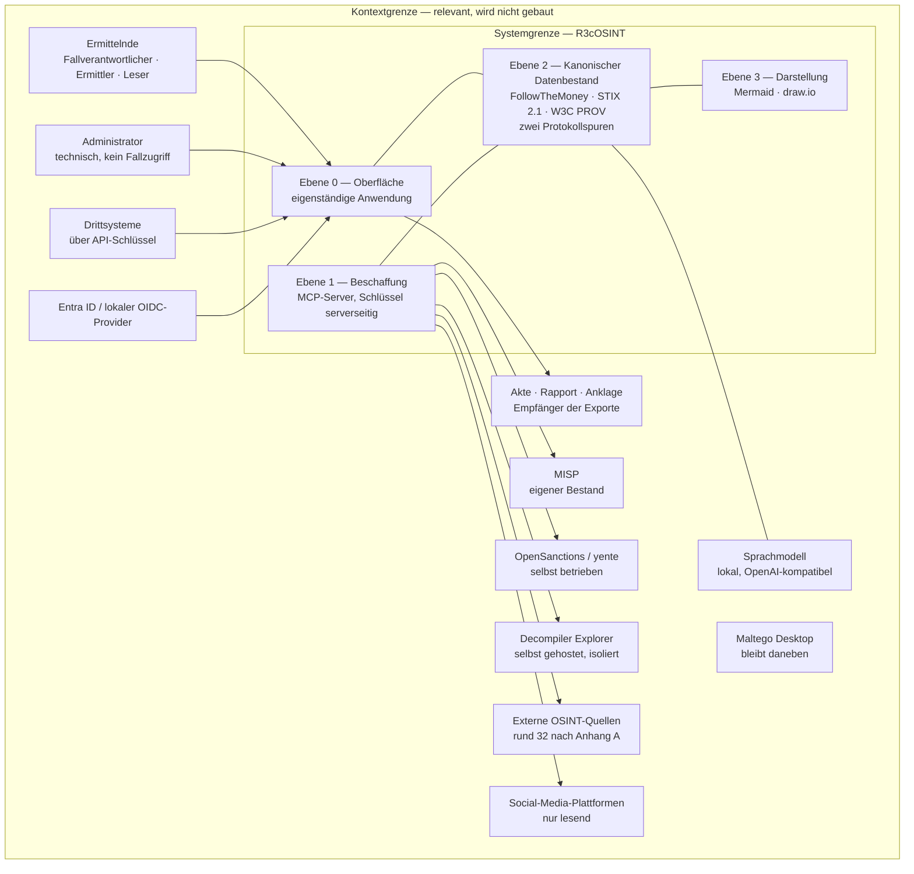

# Kontextmodell

| | |
|---|---|
| **Arbeitsprodukt nach** | Projektauftrag 6.3 |
| **Verantwortlich** | Software Architect |
| **Lebensdauer** | sich weiterentwickelnd |
| **Stand** | 2026-08-19, Erstfassung |

Dieses Modell zieht zwei Grenzen: die **Systemgrenze** (was gebaut wird) und die
**Kontextgrenze** (was für die Anforderungen relevant ist, aber nicht gebaut
wird). Alles ausserhalb der Kontextgrenze ist irrelevant und wird nicht
betrachtet.

Die Architektur der drei Ebenen ist gesetzt und wird hier nicht neu entworfen,
sondern verortet (5.1).

---

## 1. Übersicht

Die Linien von `MCP` nach `EXT` und `SOCIAL` überschreiten die
Vertrauensgrenze. Jede von ihnen ist eine **Bekanntgabe** und protokollpflichtig
(5.17).

---

## 2. Systemgrenze — was gebaut wird

| Bestandteil | Ebene | Grundlage |
|---|---|---|
| Eigenständige Benutzeroberfläche mit allen Ansichten aus Abschnitt 5 | 0 | 9.1 |
| Anmeldung, Rollen- und Klassifizierungsmodell mit Wirkung im Suchindex | 0 | 5.7, 5.8 |
| Fallverwaltung mit Kommentaren, Aufgaben, Zuweisung, Historie | 0 | 5.8 |
| MCP-Server als einziger Zugang zu den Quellen | 1 | 5.1 |
| Freigabesperre zwischen Vorschlag und Ausführung | 1 | 5.2 |
| Positivliste, Kontingentgrenzen, Behandlung fremder Inhalte | 1 | 5.4 |
| Kanonischer Datenbestand nach FollowTheMoney, STIX 2.1, W3C PROV | 2 | 5.1 |
| Zwei verkettete, ausschliesslich anfügbare Protokollspuren | 2 | 5.3 |
| Zustandsmodell für Aufbewahrung, Löschwege, Grabstein-Eintrag | 2 | 4.4 |
| Export nach STIX, FtM, PROV, PDF/A-3, CSV, XLSX mit Manifest | 2 | 5.10 |
| Graph-Erzeugung und -Bearbeitung, Mermaid- und draw.io-Ausgabe | 3 | 5.1, 5.9 |
| Modellunabhängige Zwischenschicht zum Sprachmodell | quer | 5.15 |
| Zwei getrennte Umgebungen Test/Schulung und Produktion | quer | 5.16 |
| Diagnosebereich, API-Schlüsselverwaltung, Malware-Bereich | 0 | 5.12, 5.13, 5.14 |

---

## 3. Kontextgrenze — externe Akteure und Schnittstellen

### 3.1 Menschliche Akteure

| Akteur | Schnittstelle | Richtung | Bemerkung |
|---|---|---|---|
| Fallverantwortlicher | Oberfläche | ein/aus | Eröffnet und schliesst Fälle, setzt Klassifizierung, erteilt Freigaben, Export im vollen Umfang (5.8) |
| Ermittler | Oberfläche | ein/aus | Liest und bearbeitet Fälle, führt Recherchen aus, bearbeitet den Graphen (5.8) |
| Leser | Oberfläche | aus | Nur lesen, kein Export (5.8) |
| Administrator | Oberfläche | ein/aus | Systemeinstellungen, Benutzer, Diagnose, API-Schlüssel, Quellenkonfiguration. **Kein fachlicher Zugriff auf Fallinhalte** (5.8) |

### 3.2 Systeme im Haus

| System | Schnittstelle | Richtung | Bemerkung |
|---|---|---|---|
| MISP | MCP, bestehende Anbindung | ein | Eigener Bestand, wird bei jedem Indikator automatisch mitgeprüft. Wird übernommen, nicht nachgebaut (5.17) |
| OpenSanctions / yente | MCP, selbst betrieben | ein | Selbst betrieben, damit Namen der Zielpersonen nicht an Dritte gehen |
| Sprachmodell | OpenAI-kompatible Schnittstelle | ein/aus | In Produktion ausschliesslich lokal. Modell ist Konfiguration, keine Abhängigkeit im Code (5.15) |
| Decompiler Explorer | MCP gegen lokale Instanz | ein/aus | Selbst gehostet, nicht `dogbolt.org`. Analyse isoliert, ohne Netzzugang aus dem Container (5.14) |
| TheHive, Cortex | bestehende Anbindungen | offen | Im Konzept als vorhandene Bausteine genannt; Einbindungstiefe noch nicht festgelegt |
| Entra ID beziehungsweise lokaler OIDC-Provider | OIDC / OAuth 2.0 | ein | Gebaut wird gegen einen lokalen Provider; der Wechsel ist Konfiguration (5.7) |

### 3.3 Systeme ausserhalb — jede Verbindung ist eine Bekanntgabe

| Gruppe | Beispiele | Richtung | Bemerkung |
|---|---|---|---|
| Infrastruktur und Netz | crt.sh, Shodan, urlscan.io, DomainTools, GreyNoise, AbuseIPDB | aus/ein | urlscan fest auf "nicht öffentlich"; Übersteuerung nur im Einzelfall (5.17) |
| Bedrohungsinformationen | MalwareBazaar, URLhaus, ThreatFox | aus/ein | VirusTotal ist gestrichen (5.17) |
| Schwachstellen | NVD, KEV, EPSS | aus/ein | |
| Kryptowährungen | Chainalysis Sanctions, Blockchair, Blockstream, Etherscan, Tatum | aus/ein | Sanktionsprüfung steht bewusst früh im Ablauf |
| Personen und Identität | HIBP, Sherlock/Maigret, holehe, PhoneInfoga, Epieos | aus/ein | |
| Sanktionen und Register | Zefix, GLEIF, OpenCorporates | aus/ein | |
| Darknet und Leaks | RansomLook, Ransomware.live | aus/ein | |
| Geo und Verkehr | Overpass/Nominatim, GeoNames, OpenSky, Mapillary, SunCalc, Google Geocoding | aus/ein | |
| Beweissicherung | Wayback Machine | aus/ein | `exiftool` läuft lokal |
| Social Media | Instagram, Facebook, LinkedIn, Snapchat, TikTok, X, Threads, Telegram | **nur aus/ein lesend** | Keine Fähigkeit zu Kontakt, Nachricht, Reaktion, Beitritt oder Profiländerung — fehlende Funktion, keine Einstellung (5.11) |
| Drittsysteme | über R3cOSINT-API-Schlüssel | ein | Gültigkeitsdauer, Widerruf, feingranularer Umfang, Ratenbegrenzung, vollständige Protokollierung (5.13) |

### 3.4 Empfänger von Ergebnissen

| Empfänger | Schnittstelle | Bemerkung |
|---|---|---|
| Akte, Rapport, Anklageschrift | Export der Ermittlungsspur | PDF/A-3 mit eingebetteten STIX-, FtM- und PROV-Daten (5.10) |
| Verteidigung, Gericht, Aufsicht | Export der Arbeitsspur | Wird beigelegt oder auf Verlangen herausgegeben (5.3) |
| Maltego Desktop | Datei-Austausch über draw.io und Mermaid | Bleibt das manuelle Analysewerkzeug daneben; wird nicht ersetzt und nicht ferngesteuert (5.1) |
| Repo B `r3coscrum` | GitHub-Arbeitsablauf, Verzeichnis `nachweise/` | Nur das Nachweisverzeichnis, keine Kopien der Artefakte (6.6) |

---

## 4. Ausserhalb der Kontextgrenze — nicht betrachtet

| Was | Warum |
|---|---|
| Gesichtserkennung, Galerien, biometrische Vektoren | Vom Auftraggeber gestrichen (5.18) |
| VirusTotal | Vom Auftraggeber gestrichen, auch nicht deaktiviert vorbereitet (5.17) |
| Open WebUI | Entfällt als Oberfläche (9.1) |
| CASE/UCO | Als Austauschformat zurückgenommen (5.10) |
| Fernsteuerung von Maltego | Geprüft und bewusst verworfen, nicht erneut prüfen (5.1) |
| Fallführungssystem der Kantonspolizei (Rialto, ELS) | Nicht angebunden. Die Markierung "verborgen" wird nur als Feld abgebildet, ohne Austauschweg (5.8) |
| Produktionsumgebung als Ziel der Entwicklung | Kein Zugang; getrennte Zugangsdaten (5.16) |

---

## 5. Vertrauensgrenze

Die Vertrauensgrenze verläuft **zwischen Ebene 1 und den externen Quellen**, nicht
an der Systemgrenze. Daraus folgen drei Festlegungen:

1. **Alles, was von aussen hereinkommt, ist potenziell manipuliert.** Inhalte
   werden dem Sprachmodell gekennzeichnet als Daten übergeben; Anweisungen darin
   können keine Werkzeuge auslösen (5.4).
2. **Alles, was hinausgeht, ist eine Bekanntgabe** und wird protokolliert. Nur
   Gegenstellen der Positivliste sind erreichbar (5.4, 5.17).
3. **Das System muss vollständig offline betreibbar sein.** Datenbestand und
   Darstellung funktionieren dann weiter. Das ist eine Anforderung, kein
   Nebeneffekt (5.17).

---

## 6. Offene Punkte

| Nr. | Punkt | Blockiert | Wer entscheidet |
|---|---|---|---|
| 1 | Tech-Stack, Rahmenwerk und Komponentenbibliothek der Oberfläche | Etappe 3 | Software Architect als ADR, Freigabe Auftraggeber (5.6, 9.1) |
| 2 | Einbindungstiefe von TheHive und Cortex | Etappe 2 | Software Architect |
| 3 | Ob `pgvector` gebraucht wird, nachdem die Gesichtserkennung entfällt | Etappe 1 | Software Architect (5.18) |
| 4 | Anbindungsdaten des Entra-ID-Mandanten | nur den Wechsel auf den echten Mandanten | KapoBE Informatik (7.2, C-Rest) |
